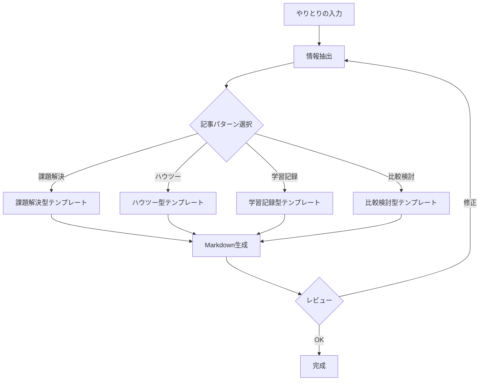

````prompt
# Prompt: Generate Blog Post from Conversation

一連のやりとり（会話、コード、調査結果など）からブログ記事用のMarkdownを生成するプロンプトです。
技術ブログ、ハウツー記事、学習記録などに活用できます。

## 前提条件

- 入力: 会話履歴、コードスニペット、エラーログ、調査メモなど
- 出力: 構造化されたブログ記事（Markdown形式）

## 指示

以下のステップで、やりとりからブログ記事を生成してください。

### Step 1: 情報の抽出

会話から以下の要素を抽出してください：

| 要素 | 説明 | 例 |
|------|------|-----|
| **課題・問題** | 何を解決しようとしたか | エラー、やりたいこと |
| **背景・動機** | なぜこの課題に取り組んだか | 困っていたこと |
| **解決策** | どうやって解決したか | コード、設定、手順 |
| **学び・気づき** | 何を学んだか | ハマりポイント、Tips |
| **成果物** | 最終的なアウトプット | コード、設定ファイル |

### Step 2: 記事構成の決定

抽出した情報から、以下のいずれかの構成を選択：

| パターン | 向いている内容 | 構成 |
|----------|---------------|------|
| **課題解決型** | エラー解決、トラブルシューティング | 課題→原因→解決策→まとめ |
| **ハウツー型** | 手順説明、チュートリアル | 目的→前提→手順→確認→まとめ |
| **学習記録型** | 新技術の調査、勉強メモ | きっかけ→調査→実践→学び |
| **比較検討型** | ツール選定、設計判断 | 背景→候補→比較→結論 |

### Step 3: Markdown生成

選択した構成に従って記事を生成してください。

## 出力フォーマット

```markdown
---
title: "[記事タイトル]"
date: YYYY-MM-DD
tags: [tag1, tag2, tag3]
---

# [記事タイトル]

[リード文: 記事の概要を2-3文で]

## TL;DR

- ポイント1
- ポイント2
- ポイント3

## 背景 / きっかけ

[なぜこの記事を書いたか、何に困っていたか]

## 課題 / やりたかったこと

[具体的な課題や目標]

## 解決策 / やったこと

### 1. [ステップ1]

[説明]

```[言語]
// コード例
```

### 2. [ステップ2]

[説明]

## 結果 / 成果

[どうなったか、Before/After など]

## 学び / ハマりポイント

- 💡 [学び1]
- ⚠️ [注意点]
- 🔧 [Tips]

## まとめ

[記事の締め]

## 参考リンク

- [リンク名](URL)
```

## オプション設定

ユーザーが指定可能なパラメータ：

| パラメータ | 説明 | デフォルト |
|-----------|------|-----------|
| `style` | 文体（casual / formal） | casual |
| `length` | 長さ（short / medium / long） | medium |
| `audience` | 対象読者（beginner / intermediate / advanced） | intermediate |
| `includeCode` | コードを含めるか | true |
| `platform` | 投稿先（Zenn / Qiita / WordPress / generic） | generic |

## 使用例

### 例1: エラー解決をブログ化

**ユーザー**: 「さっきの TypeScript エラーを解決した話をブログにして」

**エージェント**:
1. 会話から問題・原因・解決策を抽出
2. 課題解決型の構成を選択
3. Markdown形式で記事を生成

### 例2: 学習内容をまとめる

**ユーザー**: 「今日調べた Azure Functions の内容をブログ記事にまとめて」

**エージェント**:
1. 調査内容・コード例・気づきを抽出
2. 学習記録型の構成を選択
3. 参考リンク付きで記事を生成

## ワークフロー図



## 品質チェックリスト

生成した記事が以下を満たしているか確認：

- [ ] タイトルが内容を適切に表している
- [ ] TL;DR で結論がわかる
- [ ] コードにはコメントが付いている
- [ ] 専門用語には説明がある
- [ ] 参考リンクが含まれている
- [ ] 読者の次のアクションが明確

---

## プラットフォーム別フォーマット

### Zenn

```markdown
---
title: ""
emoji: "🎉"
type: "tech" # tech: 技術記事 / idea: アイデア
topics: ["topic1", "topic2"]
published: false
---
```

### Qiita

```markdown
---
title: ''
tags:
  - tag1
  - tag2
private: false
updated_at: ''
id: null
organization_url_name: null
slide: false
ignorePublish: false
---
```

````
